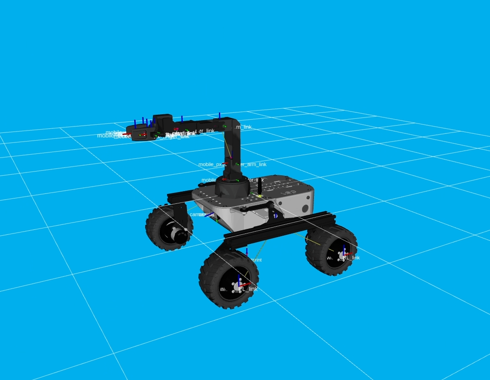

# Autonomous Rover with a Tracking Robotic Arm

The objective of this project is to design and develop a complete autonomous rover system equipped with a robotic arm. This system must be capable of tracking a flying object, such as a drone, in real time while orienting its tool (the arm) towards it. This tracking includes not only the movement of the rover but also the precise orientation of the arm to point toward the object's position in space.




• [👨‍💻 Developer documentation](docs/developer) • [📈 Project report](docs/report) • [📚 Bibliography](docs/bibliography)
## 📄 This project in short
This project is the integration of two separate robotic systems: Leo Rover and Interbotix XSArms (ViperX 300). The goal is to control the arm from the rover (with the arm embedded on the rover). The project is divided into two parts: the first is the integration of the arm on the rover, and the second is the control of the arm from the rover. The project is based on ROS2 and Gazebo.
## 🚀 Quickstart 

### Installation

After cloning the repository, you can build the docker image and run it with the following commands:

```bash
docker build -t ros2 .
docker run -it --rm -v $(pwd)/src:/home/ws/src/arm_integration ros2 bash
```	

> Note1 : Make sure you are in the repository root directory before running the above commands. (Cause it links the src folder to the docker container)

> Note2 :  -e DISPLAY=$DISPLAY -v /tmp/.X11-unix:/tmp/.X11-unix  can be added to the docker run command to enable GUI support (For linux), on Windows, you can use VcXsrv.
>

### Launch

Make sure to source ROS2
```bash
source /opt/ros/humble/setup.bash
```

Then go to the ws directory and build the package
```bash
colcon build --symlink-install
```

Then make sure you source install directory
'''bash
source install/setup.bash
'''

Then  you can run 
```bash
`ros2 launch arm_integration xsarm_moveit.launch.py robot_model:=mobile_px100 use_sim_time:=true hardware_type:=gz_classic`

```
and see if everything is working fine.

> Note : If it is crashing it is problably because of the GUI support of docker container. It is slightly different on every operating system. Check the docker documentation for more information.


## 🔍 About this project

|       |        |
|:----------------------------:|:-----------------------------------------------------------------------:|
| 💼 **Client**                |  Julien Geneste                                              |
| 🔒 **Confidentiality**       | **Public**                                         |
| ⚖️ **License**               |  Not communicated by the client                 |
| 👨‍👨‍👦 **Authors**               | Mathis Reinert, Adrien Clement, Esteban Rodriguez    |


