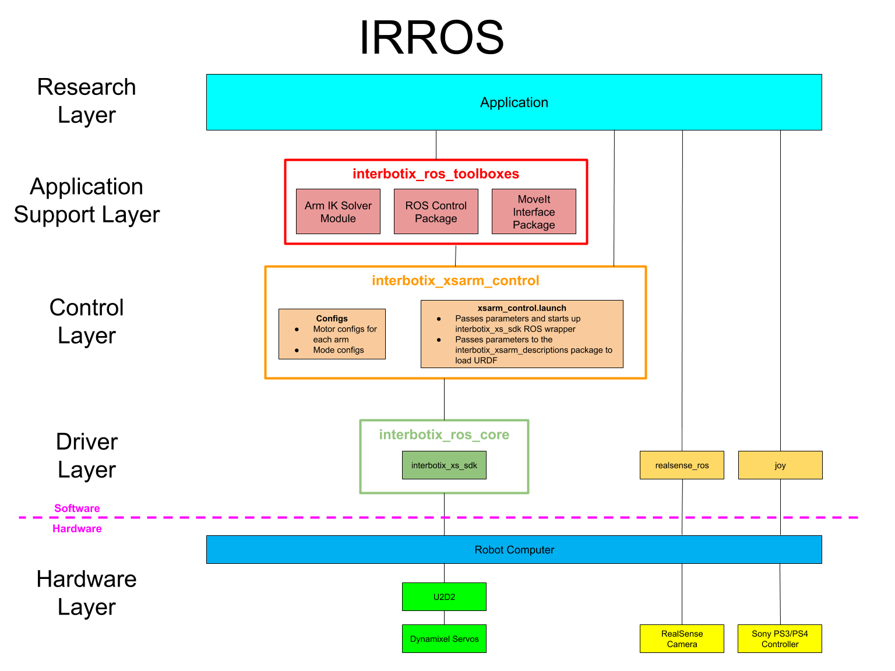

# 📖 Developer documentation

This is the documentation of the leo-viper repository which is the integration of interbotix xsarm on leo-rover robot using  ROS2.
This is only the half of the project, the other is an other repository which is the ros2 package of the arm itself which follow a given target.

## Project specifications

- **Programming language**: Python
- **ROS2 version**: Humble
- **Gazebo version**: 6 Ignition
- **Operating system**: Ubuntu 20.04

> It is recommended to use Docker container to run the project to avoid any dependency issues. But you can also put the ./src folder in your ROS2 workspace and build the package.

The core of the project is fusion of two repositories:
- [leo-rover-simulator-ros2](https://github.com/LeoRover/leo_simulator-ros2)
- [xsarm-packages](https://github.com/Interbotix/interbotix_ros_manipulators/tree/humble/interbotix_ros_xsarms)

> Don't forget to switch to **humble** branch when cloning and looking in source code on github because there are major differences between ROS2 versions (even betwen humble and foxy for instance).

The project is a ROS2 package which take the package **interbotix_ros_manipulators** and adapt all its launch files to be compatible with leo-rover simulation. You will can also find **leo_arm_sim.urdf.xacro** which is the fusionned URDF of the arm and the robot.

## Structure of XSArm package

## Launch file explanation

- **xsarm_moveit.launch.py**: Launch the moveit server for the arm. It will also launch the gazebo simulation. You'll need to launch only this launch file
- **gz_ign.launch.py**: It is the adaption to Gazebo Ignition of the simulation launcher script. You don't need to launch it directly it is used by other launch files.
- **xsarm_description.launch.py**: Launch the URDF of the arm in RViz. You can use it to visualize the arm in RViz. Also you don't need to launch it directly.
- **xsarm_control.launch.py**: Launch the control layer (cf diagram) which allow other script and nodes to control the arm. 
- **xsarm_ros_control.launch.py**: Launch the ros control layer which allow to control the arm with ROS2 messages.

### Miscs

- Rover moving script : 
- Drone target moving : You can follow the installation tutorial [here](drone_simulation.md)

## Useful link

[Hub of XSARM ROS2 packages doc](https://docs.trossenrobotics.com/interbotix_xsarms_docs/ros2_packages.html)
You'll be able to find all parameters that you can use in the launch files and the nodes.

## Future work

